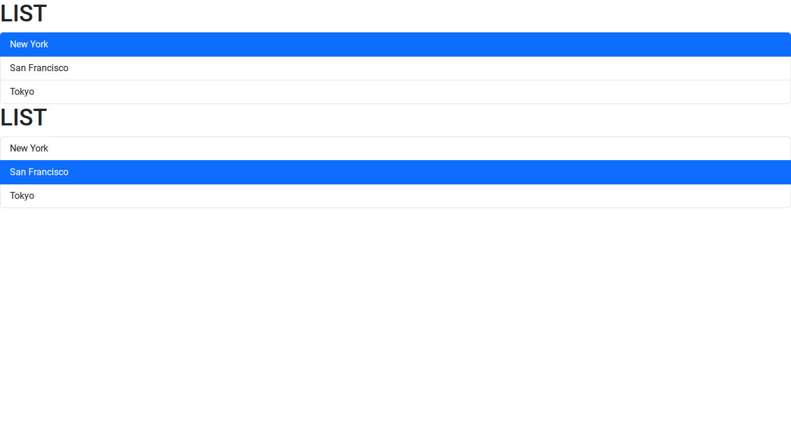

# Entry 4
# SEP10 Freedom Project
# Entry 4: Picking my tool 
##### 3/9/26
## What have I been doing?
Since the last blog entry, Ive been tinkering with my tool. The tool I picked was [React.dev](https://react.dev/). React is a program that helps users build components like a Thunmbnail and allows you to put all your components in a webpage to make it look good. React uses some parts of JavaScript and HTML which makes it easier to learn. React uses parts like function from JavaScript and you have to put HTMl inside the JavaScript. Here is an example of some React code. 
```jsx


function Message() {
    const name= 'Franco';
    if (name)
    return <h1>Hello {name}</h1>;
    return <h1>Hello World</h1>
}

export default Message;

```

```jsx 
import ListGroup from ".Message"


function App() {

  return <div><Message /></div>; 
}

export default App;

```
This code basically allows you to see your name if they know its you. I didnt learn this by myself, I had some resources to help me understand what React is, how it works, and how to set it in my IDE. I used vidoes like [This one](https://www.youtube.com/watch?v=SqcY0GlETPk). I also tried out other resources like google to help me what to download or update in my IDE. How I tinkered with React by making a new folder that is in its own seprate folder. This allows me to only see React and nothing else so I wont get distracted or confused where to cd into. The video I showed you showed me how to make a list that is clickable by using React. Here is what he showed us 
```jsx
import { useState } from "react";

function ListGroup() {
  let items = ["New York", "San Francisco", "Tokyo"];
  const [selectedIndex, setSelectedIndex]= useState(-1);


  return (
    <>
      <h1>LIST</h1>
      {items.length === 0 && <p>No item found</p>}
      <ul className="list-group">
        {items.map((item, index) => (
          <li
            className={
              selectedIndex === index
                ? "list-group-item active"
                : "list-group-item"
            }
            key={item}
            onClick={() => {setSelectedIndex(index);}}
          >
            {item}
          </li>
        ))}
      </ul>
      <h1>I love apples</h1>
    </>
  );
}

export default ListGroup;

```
This is code allows us to make a list that is able to be selected based on the one you picked. To connect this code to the wepage we have another file and it has this 
```jsx
import ListGroup from "./components/ListGroup"


function App() {

  return <div><ListGroup /><ListGroup /></div>;
}

export default App;

```
This is how the code looked in preview mode. 

After I leaned how to make a list on my own, I decied to actually tinker with the code and make it into something that I made. I decied I will make my own list using my own things. Here is the code of my tinkering. 

## Skills
There are some skills that I learned while researching my topic. Some of those skill are **How to Learn**,  and **Embracing Failure**. 
### How to Learn
While trying to teach myself how to use ReactJS, I had to learn new topics on my own in order to be sucessful in my coding journey. What I did to learn is I tinkered with the ideas I learned from my vidoes and resources and I tried to put it all together to make it into a mini webpage. This was hard because I had a lot of errors that I had to fix. So I found more resources to help me out, like google. Google is very good when you want to learn new things. When I put my code into Google, they told me that my code didnt have a export connected to it so the code had no where to go. I added a export near my code and it worked. I used my resources to learn something new on my own. What I learned is that my code always needs a export near it in order for the file or app to get it. This made me realize that I love learning on my own by using the internet. Learning on my own allows me to do anything I want and see if it works or doesn't. 
### Embracing Failure


[Previous](entry03.md) | [Next](entry05.md)

[Home](../README.md)